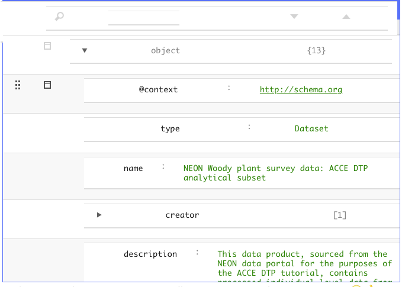

# Install necessary packages (only needed once)

install.packages("dataspice")

# Load the packages

library(dataspice)

# Create the required directory (if it doesn't exist)

dir.create("data", showWarnings = FALSE)

# Create a dataspice metadata template

create_spice(dir = "data")

# Run the Shiny app to edit metadata

edit_creators()

# The access.csv contains details about where the data can be accessed.

edit_access()

# Provide high-level information about your dataset, including title, description, license, and spatial/temporal coverage.

edit_biblio()

# Document each variable in your dataset, including its name, description, and data type.

edit_attributes()

# Now that all our metadata files are complete, we can **compile it all into a structured `dataspice.json` file** in our `data/metadata/` folder.

write_spice()

# Install and call the required libraries:

install.packages(c("jsonlite", "listviewer", "here", "magrittr", "pkgdown"))

library(jsonlite) 
library(listviewer) 
library(here) 
library(magrittr) 
library(pkgdown)

jsonlite::read_json(here::here("data", "metadata", "dataspice.json")) %\>% listviewer::jsonedit()

dataspice::build_site(path = "data/metadata/dataspice.json", template_path = system.file("template.html5", package = "dataspice"), out_path = "docs/index.html" )

# It will look like this:

# Finally, we can use the dataspice.json file we just created to produce an informative README web page to include with our dataset for humans to enjoy! 🤩

# We use function dataspice::build_site() which creates file index.html in the docs/ folder of your project (which it creates if it doesn’t already exist).

getwd() dataspice::build_site(path = "/data/metadata/dataspice.json", template_path = system.file("template.html5", package = "dataspice"), out_path = "docs/index.html" )

